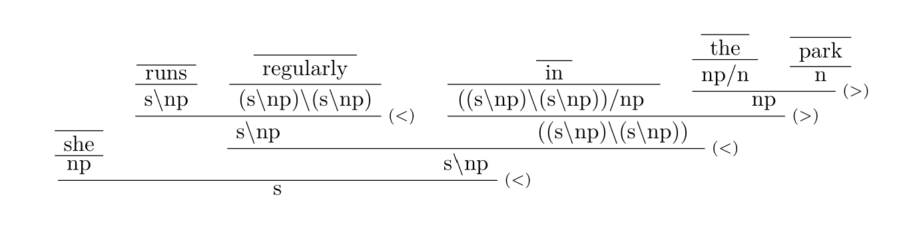

Formatter for proof trees. 

Example:

       they
       ----
       np
       ----  T
       s/(s\np);
       named
       ----
       ((s\np)/np)/np
     ----  >B2
     (s/np)/np;
     their son Stan and their daughter Shelly
     ----
     s\((s/np)/np)
    ----  <
    s

Quick and dirty formatter that compiles ascii syntax into latex bussproof trees. I usually use it within pandoc so it probably should be a pandoc filter instead of a seperate program.

To have multiple proofs on the same level these both work:

      child2
        child1
    ----
    base

and

      child2;
      child1
    ----
    base

the semicolon notation generally is more readable for larger trees. Note that no whitespace is allowed after `----` and `;`
